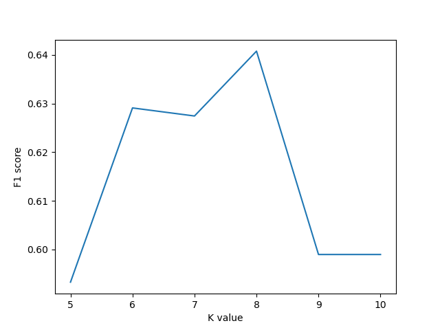
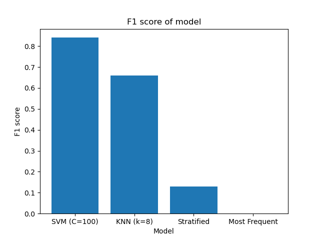

# asteroids

Data was downloaded from: https://www.kaggle.com/shrutimehta/nasa-asteroids-classification

Data is found in `nasa.csv`

The dataset contains information about 4687 asteroids and a hazardous classification. 
The features in the dataset are:
'Neo Reference ID', 'Name', 'Absolute Magnitude', 'Est Dia in KM(min)',
       'Est Dia in KM(max)', 'Est Dia in M(min)', 'Est Dia in M(max)',
       'Est Dia in Miles(min)', 'Est Dia in Miles(max)',
       'Est Dia in Feet(min)', 'Est Dia in Feet(max)', 'Close Approach Date',
       'Epoch Date Close Approach', 'Relative Velocity km per sec',
       'Relative Velocity km per hr', 'Miles per hour',
       'Miss Dist.(Astronomical)', 'Miss Dist.(lunar)',
       'Miss Dist.(kilometers)', 'Miss Dist.(miles)', 'Orbiting Body',
       'Orbit ID', 'Orbit Determination Date', 'Orbit Uncertainity',
       'Minimum Orbit Intersection', 'Jupiter Tisserand Invariant',
       'Epoch Osculation', 'Eccentricity', 'Semi Major Axis', 'Inclination',
       'Asc Node Longitude', 'Orbital Period', 'Perihelion Distance',
       'Perihelion Arg', 'Aphelion Dist', 'Perihelion Time', 'Mean Anomaly',
       'Mean Motion', and 'Equinox'.

Some of the features can be eliminated as duplicates since they are the same 
metric using different units (distance, velocity).

The data was read using pandas. Features that were duplicates were dropped in addition to 
features that were the same in every sample (Orbiting body, Equinox). IDs and dates were
also dropped. The data was split into 70% training data, 15% development data, and 
15% test data using sklearn's train_test_split. Data was normalized using sklearn's 
StandardScaler. 

```python
import pandas as pd
from sklearn.model_selection import train_test_split
from sklearn.preprocessing import StandardScaler

# read data using pandas
data = pd.read_csv("nasa.csv")

# select features
features = ['Absolute Magnitude', 'Est Dia in KM(min)',
       'Est Dia in KM(max)',
       'Epoch Date Close Approach', 'Relative Velocity km per sec',
       'Miss Dist.(kilometers)',
       'Orbit Uncertainity',
       'Minimum Orbit Intersection', 'Jupiter Tisserand Invariant',
       'Epoch Osculation', 'Eccentricity', 'Semi Major Axis', 'Inclination',
       'Asc Node Longitude', 'Orbital Period', 'Perihelion Distance',
       'Perihelion Arg', 'Aphelion Dist', 'Perihelion Time', 'Mean Anomaly',
       'Mean Motion']

# set target
y = data.Hazardous

# subset data
X = data[features]

# split data into 70% training 30% testing / development
X_train, X_temp, y_train, y_temp = train_test_split(X, y, random_state=1, train_size=0.7)

# split test / development data equally
X_dev, X_test, y_dev, y_test = train_test_split(X_temp, y_temp, random_state=1, train_size=0.5)

# scale data using sklearn StandardScaler
sc = StandardScaler()

# fit scaler on training data
sc.fit(X_train)

# transform training and validation data
X_train = sc.transform(X_train)
X_dev = sc.transform(X_dev)
X_test = sc.transform(X_test)
```

To help test models, a function was created to return accuracy 
when given a training and test dataset and a model. 

```python
from sklearn.metrics import accuracy_score

def test_model(train_X, val_X, train_y, val_y, model):
    """Function to return the accuracy of a given model and dataset"""
    # Fit model
    model.fit(train_X, train_y)

    # get predicted values
    val_predict = model.predict(val_X)

    # return accuracy
    return accuracy_score(val_y, val_predict)
```

### Support Vector Machine

The first model tested was an SVM implemented in sklearn  
sklearn.svm.SVC. Using the default parameters, the accuracy was
0.9516 using the development dataset.

```python
from sklearn.svm import SVC

# default SVM 
svm = SVC()

# calculate accuracy
accuracy = test_model(X_train, X_dev, y_train, y_dev, svm)
```

A function was created to help optimize the regularization parameter in the SVM
model. This function returns a list of the values used and accuracy of the models.

```python
def test_svm_c(train_X, val_X, train_y, val_y,c_list=[0.0001, 0.001, 0.01, 0.1, 1, 10, 100, 1000, 10000]):
    """Function to test SVM using different regularization parameters"""
    res = []
    for c in c_list:
        model = SVC(C=c)
        res.append(test_model(train_X, val_X, train_y, val_y, model))

    return c_list, res

# plot SVM accuracy vs C
c_list, acc = test_svm_c(X_train, X_dev, y_train, y_dev)
plt.plot(c_list, acc)
plt.xscale('log')
plt.xlabel("Regularization Parameter (C)")
plt.ylabel("Accuracy")
plt.savefig("svm_c_tests.png")
plt.close()
```

The best value of C was 100. This resulted in an accuracy of 0.9644.
The accuracy at each value of C is shown in the following plot. 


### K-Nearest Neighbors

The next model tested was a KNN classifier. The implementation used is shown below. 
The KNN classifier uses 3 basic steps. 

1. The euclidean distance is calculated (euclidean_dist() function)

2. Get k nearest neighbors (find_nearest_neighbors() function)

3. Make predictions based on class with most votes from nearest neighbors (predict() function)

```python
class KNN(object):
    """Implementation of K-nearest Neighbor Classifier"""
    def __init__(self, k=5, random_state=1):
        self.k = k
        self.random_state = 1


    def euclidean_dist(self, p1, p2):
        """Calculate euclidean distance between two datapoints"""
        # initialize distance to zero
        dist = 0.0
        # loop through all values in data[pomt
        for i in range(len(p1)-1):
            # add squared difference
            dist += (p1[i] - p2[i])**2
        # return square root of distance
        return sqrt(dist)


    def find_nearest_neighbors(self, train_x, train_y, p):
        """Cacluate k nearest neighbors given a trainin dataset and a test row"""
        # initialize list to act as priority queue of distances
        dists = []
        # loop through the training data
        for (row, y) in zip(train_x, train_y):
            # calculate the euclidean distance at each row
            dist = self.euclidean_dist(row, p)
            # add the distance and data to the priority queue
            heapq.heappush(dists, (dist, row, y))
        # return k nearest neighbors
        return heapq.nsmallest(self.k, dists)


    def fit(self, X, y):
        self.train_x = X
        self.train_y = y


    def predict(self, X):
        # initialize predictions list
        predictions = []
        # loop through each row in the dataset
        for row in X:
            # get k nearest neighbors
            knn = self.find_nearest_neighbors(self.train_x, self.train_y, row)
            # dictionary to hold votes for target values
            votes = dict()
            # loop through all neighbors
            for n in knn:
                # get target value
                value = n[-1]
                # increment target vote by 1 if already in dictrionary
                if value in votes:
                    votes[value] = votes[value] + 1
                # else initialize vote to 1
                else:
                    votes[value] = 1
            # append target value with max votes to predictions
            predictions.append(max(votes, key=votes.get))
        return predictions
```

To identify the optimal k value for the KNN classifier, a function was created
to test the accuracy of the model at each value.

```python
def test_k(train_X, val_X, train_y, val_y,k_list=[5, 6, 7, 8, 9, 10]):
    """Function to test SVM using different regularization parameters"""
    res = []
    for k in k_list:
        model = KNN(k=k)
        res.append(test_model(train_X, val_X, train_y, val_y, model))

    return k_list, res

# plot KNN accuracy vs C
k_list, acc = test_k(X_train, X_dev, y_train, y_dev)
plt.plot(k_list, acc)
plt.xlabel("K value")
plt.ylabel("Accuracy")
plt.savefig("knn_k_tests.png")
plt.close()
```

The results of the test_k function are shown below. This identified 8 as the optimal k 
value resulting in an accuracy of 0.8947 when tested using the development dataset.


### Baseline Models

To help evaluate performance of the models, two baseline models were used. The
DummyClassifier from sklearn was used with either a stratified strategy or a most_popular
strategy. The accuracy was 0.7354 for the stratified baseline and 0.8335 for the most_frequent
baseline model using the development dataset. Both the KNN and SVM models performed better than 
the baseline. 

```python
from sklearn.dummy import DummyClassifier
# set baseline models
baseline_stratified = DummyClassifier(strategy='stratified')
baseline_most_frequent = DummyClassifier(strategy='most_frequent')
# test models
test_model(X_train, X_dev, y_train, y_dev, baseline_stratified)
test_model(X_train, X_dev, y_train, y_dev, baseline_most_frequent)
```

### Model Comparison

The performance of the SVM model with C=100 and the KNN model with k=8 was evaluated 
using the test dataset. The baseline models were also included in these tests.

```python
# test models on development dataset
test_acc = []
models = ['SVM (C=100)', 'KNN (k=8)', 'Stratified', 'Most Frequent']
test_acc.append(test_model(X_train, X_test, y_train, y_test, svm_c100))
test_acc.append(test_model(X_train, X_test, y_train, y_test, knn))
test_acc.append(test_model(X_train, X_test, y_train, y_test, baseline_stratified))
test_acc.append(test_model(X_train, X_test, y_train, y_test, baseline_most_frequent))

# plot accuracy for each model
plt.bar(models, test_acc)
plt.xlabel("Model")
plt.ylabel("Accuracy")
plt.title("Accuracy of model")
plt.savefig("model_comparison_test.png")
plt.close()
```

The SVM model had the best performance with an accuracy score of 0.9488. The accuracy of 
the KNN model (0.9019)  was slightly above the most_frequent baseline (0.8366). The 
stratified baseline performed the worst with and accuracy of 0.6974. The accuracy of the models
is shown below.
 

 
### Usage
 
All code is found in `asteroids.py`. The script will read the `nasa.csv`
file in the same directory as the script. It will output 3 plots. 
 
Example: 
 
```
python asteroids.py
```